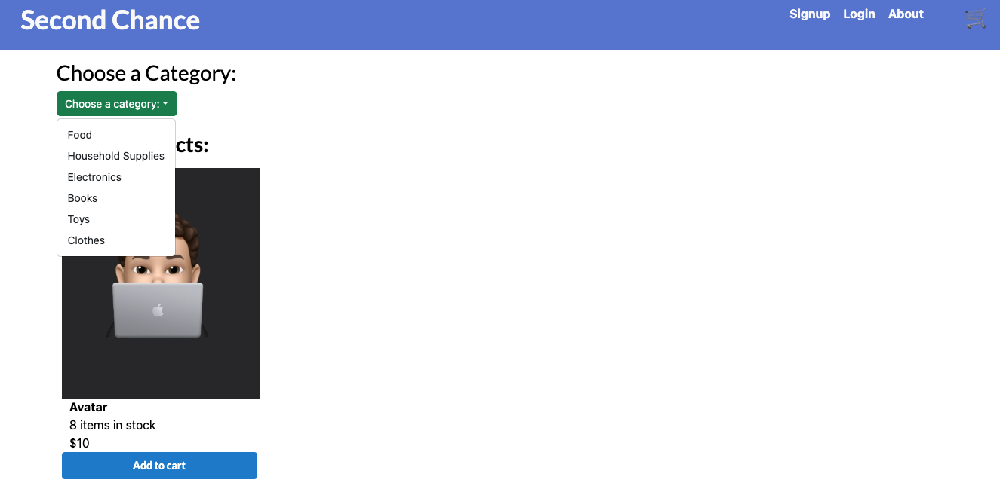
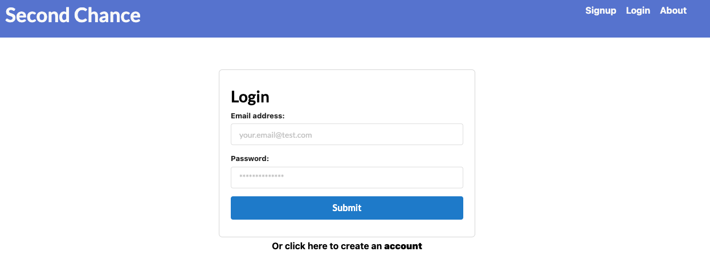
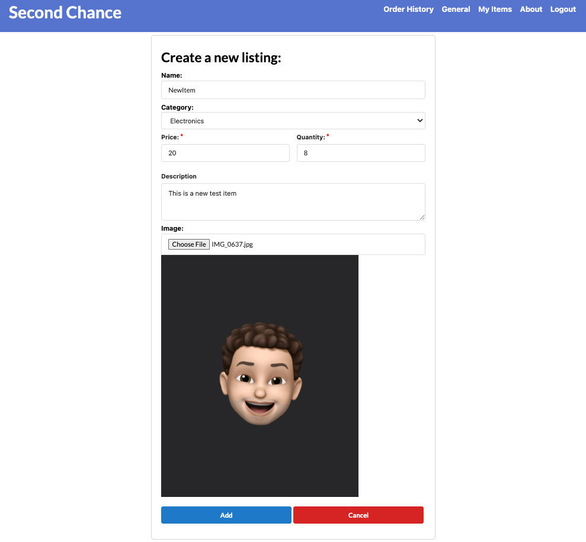
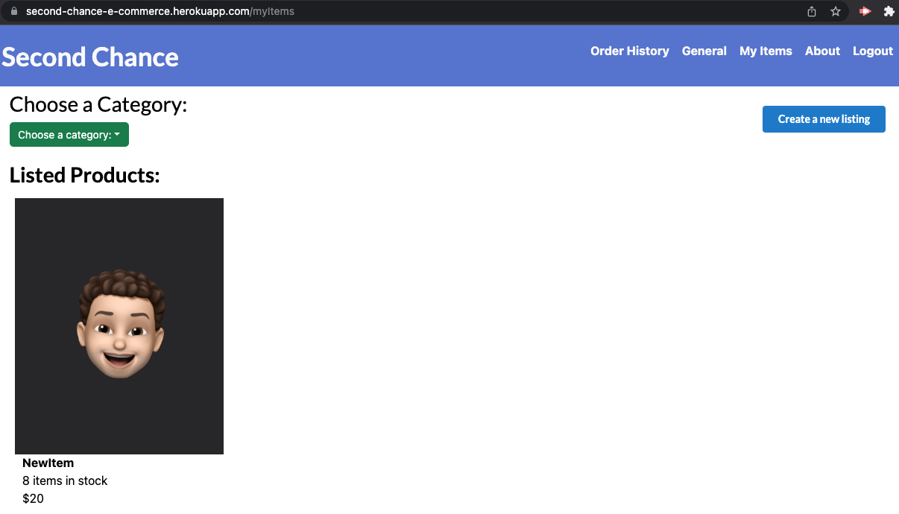

# SecondChance
**SecondChance** is an e-commerce solution built using the **MERN Stack**. **SecondChance** makes it possible to bring new life to products users once needed and loved by enabling users to sell and buy second-hand products in an **easy** and **convenient** way.

## Description
Considering that a user wants to buy and sell second-hand items. The following user story has been implemented:
 - AS A user
 - I WANT to be able to view and post products
 - SO THAT I can browse, buy and sell as I wish
    - GIVEN an e-commerce platform
    - WHEN I load the page
    - THEN I am presented with a navigaton menu, option to select from categories of products, and a list of products
    - WHEN I view the navigation menu
    - THEN I am presented with Sign up, Login, About, and shopping cart options
    - WHEN I view the categories section
    - THEN I am presented with the current categories listed on the platform
    - WHEN I view the body of the homepage
    - THEN I am presented with an array of products listed on the platform
    - WHEN I click on Sign up
    - THEN I am presented with a sign up form
    - WHEN I click on Login
    - THEN I am promoted to enter the informaton I provided on the Sign up form
    - WHEN I click on About
    - THEN I am presented with a page containing a brief description about the platform
    - WHEN I click an item on the homepage
    - THEN I am presented with that item's page with an item description, item price, and options to `add` and `remove` from cart
    - WHEN I click on `Add to Cart`
    - THEN I that item gets added to the shopping cart and I can checkout, remove the item, or change the item quantity
- WHEN I am `logged in`
    - THEN I can view Order History, General, My Items, About, and Logout
    - WHEN I click on `Order History`
    - THEN I am presented with a page containing the items I've ordered in the past
    - WHEN I click on `General`
    - THEN I am presented with the homepage
    - WHEN I click on `My Items`
    - THEN I am presented with a page listing the items I listed on the platform and an option to add an item
    - WHEN I click to `Add Item`
    - THEN I am presented with a form to enter a product name, category, description, price, quantity, and an image of the product
    - WHEN I click `Add`
    - THEN that item is added to the database and listed on the platform
    - WHEN I click on `Logout`
    - THEN I am taken back to the homepage

## Table of Contents
- [Description](#description)
- [Usage](#usage)
- [Demo](#demo)
- [License](#license)
- [Tech Stack](#technologies)
- [Contributing](#contributing)
- [Feedback & Contribution](#feedback-and-contribution)

## Usage
To run and test this application, simply access the deployment [URL](https://second-chance-e-commerce.herokuapp.com/) and follow the instructions listed on the [user story](#description).

 - [Click to run the App!](https://second-chance-e-commerce.herokuapp.com/)

 

## Demo
### View the following screen shots of the app:
<!-- ADD SCREENSHOTS WHEN FRONT-END IS FINISHED -->

 

 

 

 

 

## Test
    – To test and use the app on your local machine follow the instructions:
        • Clone the repository
        • Ensure you are in the project directory
        • Run "npm i" or "npm install" to install the required packages
        • Then run "npm start" to launch the server
        • Followed by "npm run build" to build the REACT app and "npm run develop" to load the development environment

## License
This project is licensed under the MIT License.

## Technologies

    – Framewors:
        • REACT

    – Database:
        • MongoDB

    – APIs:
        • Stripe

    – Libraries:
        • Graphql
        • Apollo Server
        • mongoose
        • bootstrap
## Contributing
If you are interested in contributing to the project you can `fork` the repository and submit a `pull request`.

## Feedback and Contribution
Comments, suggestions, questions? Contact the project developers:
#### [Rafael Abreu](https://github.com/rfabreu) | [Arslan Tahir](https://github.com/tahir-arslan) | [Leonel Pinzon](https://github.com/Leman102) | [Vadad Rzali](https://github.com/vrzali)

Link to deployed application: [Use the Weather App!](https://second-chance-e-commerce.herokuapp.com/)